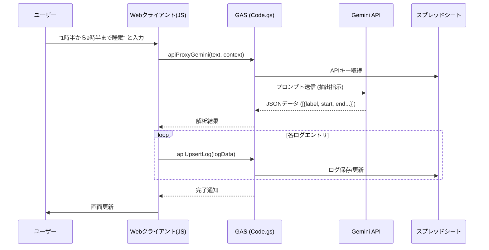
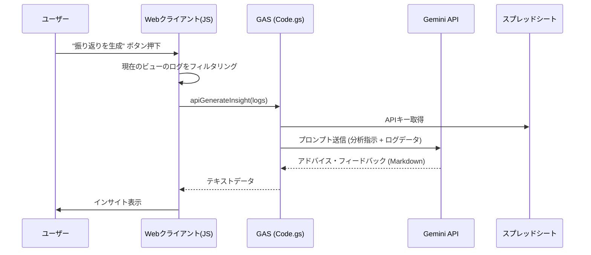

# システム設計・フロー図

**gas-lifelog** のアーキテクチャとデータフローの概要。

## 1. システム概要
**gas-lifelog** は、Google Apps Script (GAS) をバックエンドとした、AI搭載のライフログ・ダッシュボードアプリケーションです。
ユーザーは日々の活動（睡眠、仕事、その他）を記録・可視化し、生活リズムの改善に役立てることができます。
主な機能として、日/週/月別の活動カレンダー表示、ドラッグ＆ドロップ（またはクリック）による直感的なログ編集、そしてGemini APIを活用した「自然言語によるログ登録」と「ライフリズム分析（インサイト生成）」を備えています。
データはGoogleスプレッドシートに永続化され、GASがAPIサーバーおよびWebサーバーとして機能します。

## 2. 画面遷移 (ユーザー体験)

```mermaid
graph TD
    Start[開始: WebアプリURL] --> Routing{doGet}
    Routing --> Dashboard[ダッシュボード (index.html)]
    
    subgraph Views [メインビュー]
        Dashboard -- タブ切替 --> DayView[日別ビュー]
        Dashboard -- タブ切替 --> WeekView[週別ビュー]
        Dashboard -- タブ切替 --> MonthView[月別ビュー]
        Dashboard -- タブ切替 --> CatView[カテゴリ管理]
    end

    subgraph Actions [アクション]
        DayView -- ログクリック/追加 --> EditModal[編集モーダル]
        WeekView -- ログクリック --> EditModal
        MonthView -- 日付クリック --> DayView
        CatView -- 追加/編集 --> CatModal[カテゴリ設定モーダル]
        
        Dashboard -- 自然言語入力 --> AIAnalysis[AI解析・登録]
        DayView -- 振り返りボタン --> Insight[AIインサイト生成]
        WeekView -- インサイトボタン --> Insight
        MonthView -- 診断ボタン --> Insight
    end

    EditModal -- 保存/削除 --> UpdateDB[データ更新]
    CatModal -- 保存/削除 --> UpdateDB
    AIAnalysis -- 登録 --> UpdateDB
```

## 3. データフロー (技術アーキテクチャ)

### 3.1 自然言語によるログ登録フロー



### 3.2 AIライフリズム分析フロー



## 4. テクノロジースタック

-   **バックエンド**: Google Apps Script (GAS)
-   **フロントエンド**: HTML5, Vanilla JavaScript, Tailwind CSS (CDN), Chart.js (CDN), FontAwesome (CDN)
-   **AI**: Google Gemini API (gemini-2.5-flash-preview)
-   **データベース**: Google Spreadsheet
-   **デプロイ**: clasp (Command Line Apps Script Projects)
